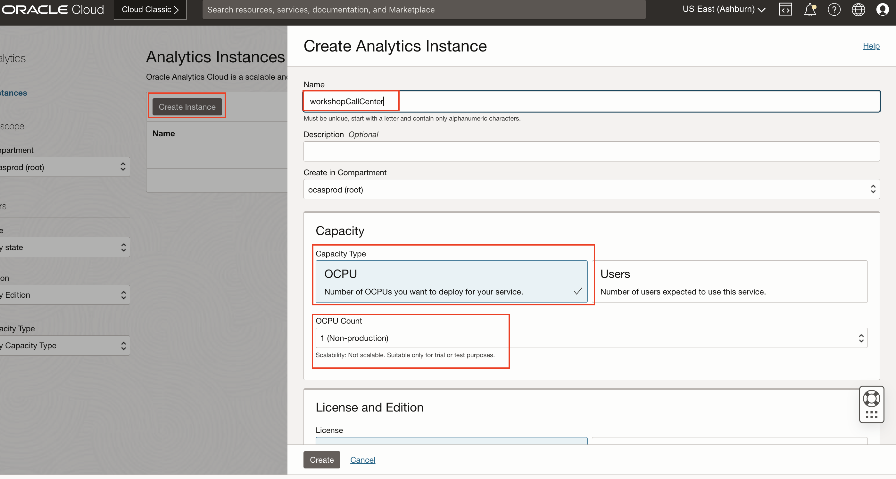
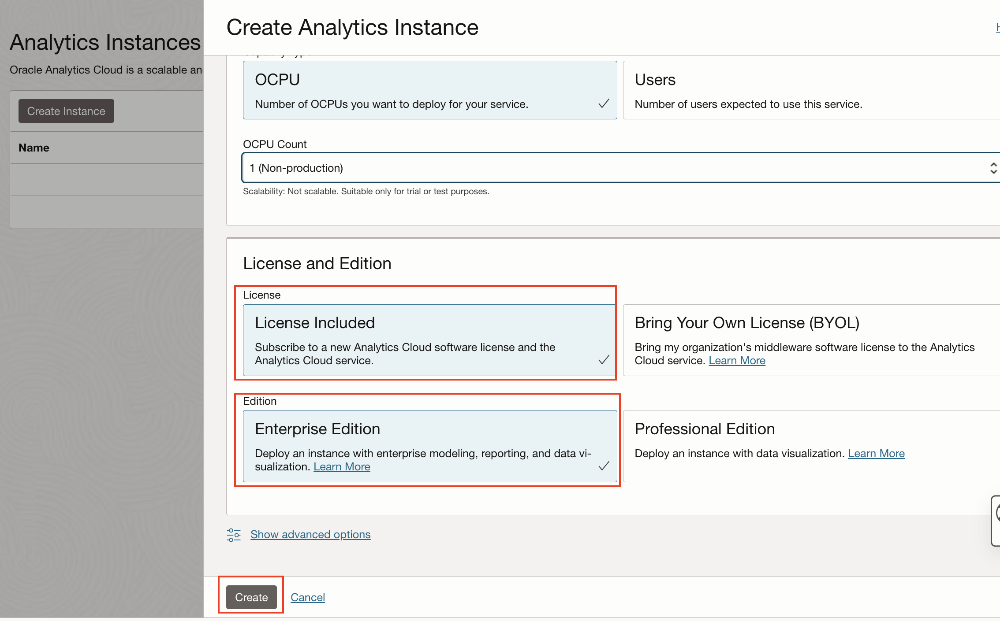

# Lab 2: Provision your Oracle Analytics(OAC) instance

## Introduction

This section describes the process of deploying **Oracle Analytics Cloud** instances on Oracle Cloud Infrastructure Gen 2, which is the default for newly provisioned accounts in **EMEA** and **US**.

Your Oracle Cloud Free Tier account will use the Oracle Cloud Free Trial **credits** while this instance is provisioned, as Oracle Analytics Cloud is not part of the **Always Free** cloud services.

> ***Estimated Lab Time***: 15 minutes

### Objectives
- Create an Oracle Analytics Cloud Instance

## Task 1: Create an Oracle Analytics Cloud (OAC) Instance

1. Go to the **Home Console Page** and navigate to **Analytics & AI** section and then **Analytics Cloud**.

   

2. Select **Create Instance**.

   Complete the form using the following information:

   - **Instance Name**: `workshopcallcenter`

   - **Description**: optional

   - **Compartment**: Select a valid compartment in your tenancy

   - **Description**: &lt;optional&gt;

   - **Capacity**:
      - Capacity Type: OCPU
      - OCPU Count: 1 (Non-production)

   - **License and Edition**:
      - License: License Included
      - Edition: Enterprise Edition

   

3. Select **Create**

   

4. The Analytics instance page will be displayed with a status of **CREATING**.

## **Task 2**: Create a Connection to an Autonomous Data warehouse

This concludes this lab. You may now **proceed to the next lab**.

## **Acknowledgements**

**Authors**
* Sahil Kalra - Oracle AI OCI Language Services

**Last Updated By/Date**
* Sahil Kalra - Oracle AI OCI Language Services, April 2023
